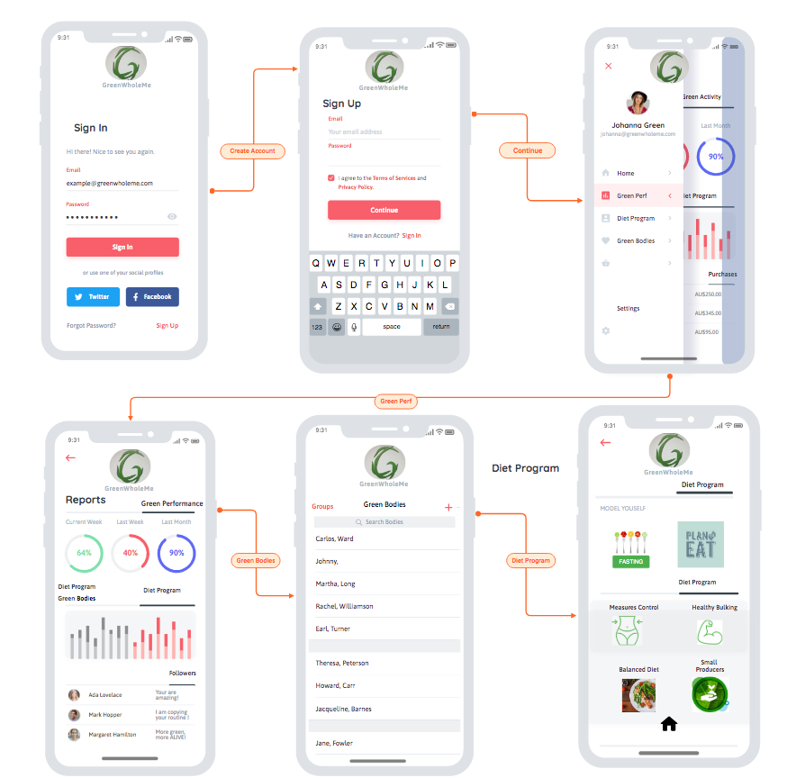

      gem simple_form

  <h1 align="center">GREENWHOLEME</h1>

## Description of my APP - Heathy Social Network   ##
 
 
## Providing Support for Small Producers and Organic Products of Any Nature ##
 

## Statement Purpose and Scope ##
 
  The main puporse of my application is XXXXXXXXXXXXXXXXXXXXXXXXXXXXX---
 

 

# GreenWholeMe - WireFrame (Break it down between each screen showing the process for the user to access it) ##

 <tr>
    <td>
        
    </td>
    <td>
        
    </td>
  </tr>
</table>

 

 

## Installation Requirements ##

 
 
 ---
## Project Management ##
<table>
  <tr>
    <th>Project Stages - FlowChart </th>
  </tr>
  <tr>
    <td>
        
    </td>
  </tr>
</table>

## Functionality/Features ##

- XXXXXXXXXXXXXXXX- 
- XXXXXXXXXXXXXXXX- 
- XXXXXXXXXXXXXXXX- 

### Project Management ###

Personal information include name, telephone, website and email.

Links to Github, Linkedin, StackOverflow, Medium e Instagram

### App - User Experience ###
<table>
  <tr>
    <th> User Experience - User Input 1  - Postal Code Screen  </th>
  </tr>
  <tr>
    <td>
        
    </td>
  </tr>
</table>

 

<table>
  <tr>
    <th> User Experience - User Input 2 - Postal Code Display - Response  </th>
  </tr>
  <tr>
    <td>
        
    </td>
  </tr>
</table>

### Continuous Integration ###

<table>
  <tr>
    <th> Git -  Continuous Integration Process  </th>
  </tr>
  <tr>
    <td>
        
    </td>
  </tr>
</table>

 
 
 
 
 <table>
  <tr>
    <th> Git - Continuous Integration Process   </th>
  </tr>
  <tr>
    <td>
 <tr>
    <td>
        
    </td>
  </tr>
</table>

 
 
 
 
 <table>
  <tr>
    <th> GitHub - Continuous Integration Process - Checking Status   </th>
  </tr>
  <tr>
    <td>
 <tr>
    <td>
        
    </td>
  </tr>
</table>

 
 
 
 
 
  
 <table>
  <tr>
    <th> GitHub - Continuous Integration Process - Checking Status Final   </th>
  </tr>
  <tr>
    <td>
 <tr>
    <td>
        
    </td>
  </tr>
</table>

 
  
  

 
 
 
 
 
 

### Packages Required ###
 
 
 
 <table>
  <tr>
    <th> API - NEED AN IDEA FOR API STILL - Response  </th>
  </tr>
  <tr>
    <td>
        
    </td>
  </tr>
</table>

 
 
 
 
 <table>
  <tr>
    <th> API -  API - SOURCE   </th>
  </tr>
  <tr>
    <td>
 <tr>
    <td>
        
    </td>
  </tr>
</table>

 
 
 
  
  
 
 ---
## Target audience ##
 
XXXXXXXXXXXXX Still ABOUT TO DEFINE it HERE.

---

 
 

---
## Final Statement ##
 
 

  XXXXXXXXXXXXXXXXXXXXXXXXXXXXX 
---
